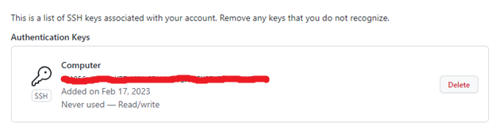
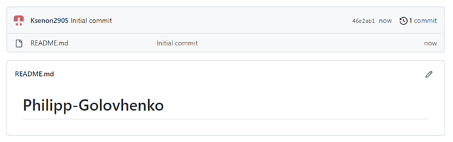

Мета роботи: зарееструватися на Github та навчитися користуватися базовими командами у GitBash

Виконання завдання:

Створюємо обліковий запис на Github:

 

Рисунок 1 – Обліковий запис

Встановлюємо CHOCOLATEY за допомогою Powershell:
Для цього використовуємо у powershellкоманду:

Set-ExecutionPolicy Bypass -Scope Process -Force; [System.Net.ServicePointManager]::SecurityProtocol = [System.Net.ServicePointManager]::SecurityProtocol -bor 3072; iex ((New-Object System.Net.WebClient).DownloadString('https://chocolatey.org/install.ps1'))

Встановлюємо гіт (гіт в мене вже був встановлений).
Налаштовуємо гіт вказавши ім'я та адресу електронної пошти:
Для цього використаємо команди:

git config --globaluser.name "PhilippGolovchenko"

git config --global user.email f.o.holovchenko@student.khai.edu

Згенеруємо новий SSH ключ:
Використаємо команду:

ssh-keygen -t ed25519 -C "f.o.holovchenko@student.khai.edu"

В результаті отримали файл с публічним та приватним ключем.

Додамо ключ до облікового запису Github:

Рисунок 2 – ключ до облікового запису

Створимо новий репозиторій:

Рисунок 3 – Новий репозиторій

Завантажимо репозиторій на компьютер за допомогою ssh.
Використаємо команду:

git clone git@github.com:Ksenon2905/Philipp-Golovhenko.git

Відредагуємо Readme.md файл та відправимо його до репозиторію на github:
Команди:

git add .

git commit -m "Add your comment"

git push

Висновки

Під час виконання лабораторної роботи ми створили обліковий запис на github та встановили git на компьютер. Після цього налаштували gitна компьютері, прив'язали git на компьютері із обліковим записом github.

Створили новий репозиторій, клонували його на компьютер, відредагували його та спробували відправити його обратно до репозиторію.

Вивчили базові команди для того, щоб завантажувати файли до репозиторію на github.