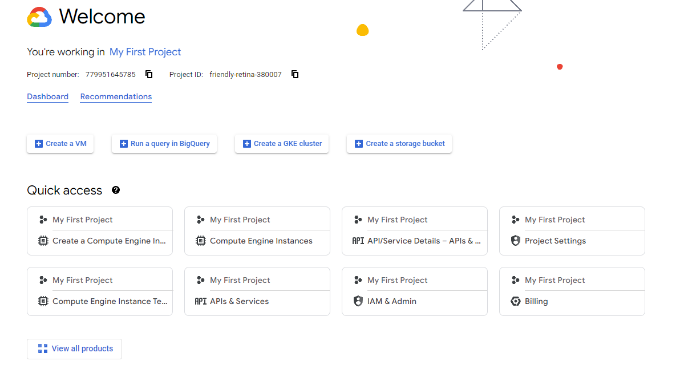
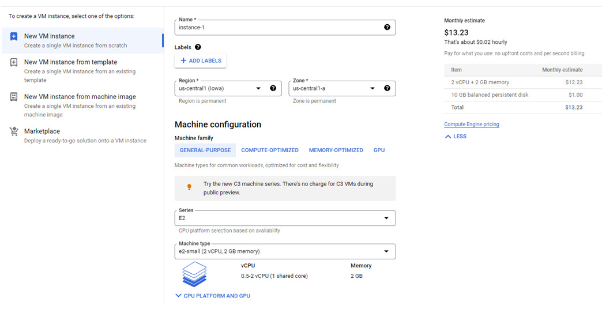
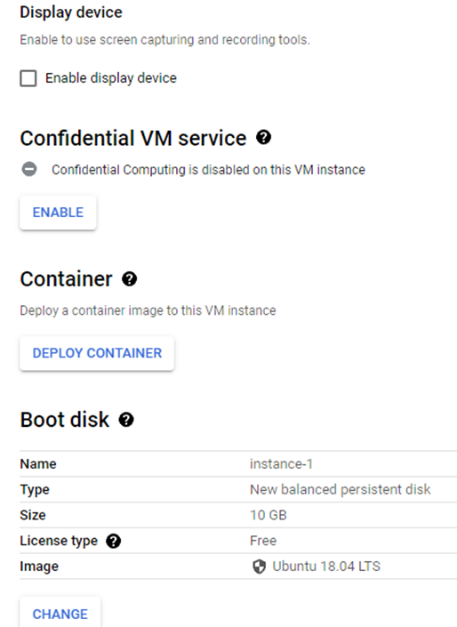
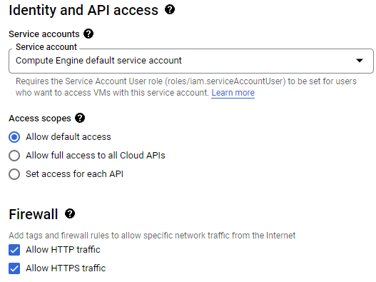
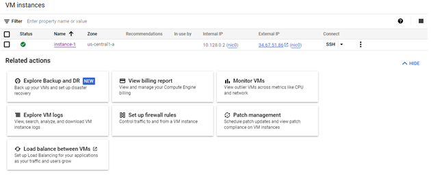
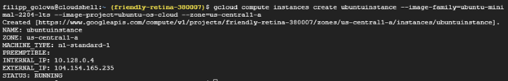
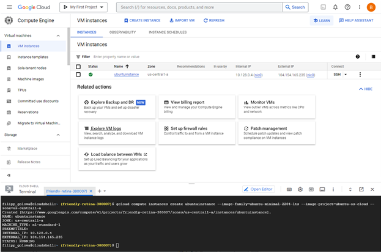

Мета роботи: створити аккаунт в GCP та порівняти два різних засоба створення віртуальної машини в gcloud.

Виконання завдання:

Створюємо акаунт GCP



Рисунок 1 – створили акаунт GCP

Після цього, створюємо проект

1. Перший VM instance створимо графічним способом:

Вибираємо регіон, зону, серію та тип віртуальної машини:



Рисунок 2 – VM instance створений графічним способом

Змінюємо операційну систему на ubuntu:



Рисунок 3 – VM instance створений графічним способом

Даємо дозвіл фаєрволу вихід в інтернет за всіма протоколами:



Рисунок 4 – VM instance створений графічним способом

Після створення, отримуємо окно із запущеною VM:



Рисунок 5 – VM instance створений графічним способом

2. Другий VM instance створимо за допомогою утиліти gcloud:

Введемо в термінал:
```
gcloud compute instances create ubuntuinstance --image-family=ubuntu-minimal-2204-lts --image-project=ubuntu-os-cloud --zone=us-central1-a
```
Тобто, ми створюємо instance із іменем ubuntuinstance, із операційною системою ubuntu-minimal-2204-lts, із проекту ubuntu-os-cloud та в зоні us-centrali-a



Рисунок 6 – VM instance створений за допомогою утиліти gcloud



Рисунок 7 – VM instance створений за допомогою утиліти gcloud

Ми створили VM instance двома різними способами: графічним та за допомогою  утиліти gcloud.

Графічний спосіб створення VM instance:

Переваги: 

1.Дуже зручно вибирати різні настройки для VM для тих, хто перший раз створює VM.

2.Можна подивитися весь каталог настроєк, який пропонує gcloud в зручному інтерфейсі

Недоліки:

1.Довга настройка VM, тобто для досвідченого користувача, створення VM графічним способом буде займати більше часу, ніж за допомогою утіліти.

2.Неможливість автоматизувати створення VM, тільки вручну.

Спосіб створення VM instance за допомогою утіліти:

Переваги: 

1.Утіліта gcloud дозволяє дуже швидко створювати велику кількість VM instance.

2.За допомогою утіліти можна автоматизувати створення VM instance, а не створювати кожну окрему VM вручну.

Недоліки:

1.Для недосвідченого користувача створення VM за допомогою утіліти буде важким, тому що одразу не зрозуміло, які ключі використовувати для налаштування VM.

2.Для гарної настройки VM треба довго вивчати документацію.

Висновки

Під час виконання лабораторної роботи створили акаунт Gcloud, після цього створили свій перший проект у якому створили перші віртуальні машини двома різними способами: графічним та за допомогою утіліти gcloud.

Після створення віртуальних машин порівняли процес створення, назвали переваги та недоліки обох способів.

Для недосвідчених користувачів краще використовувати графічний спосіб, тому що він більш зрозумілий та дає зручний спосіб ознайомитися із усіма настройками VM. Для досвідчених краще використовувати утіліту для економії часу.
