# Лабораторна робота 3

# 1.Встановлення Terraform

Для встановлення Terraform використаємо chocolatey:
```
choco install terraform
```
Після цього перевіримо установку terraform:
```
Terraform version
```
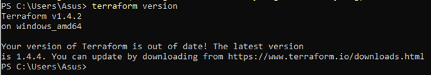

# 2.Автоматизація створення віртуальної машини

Створимо віртуальну машину автоматизовано. Для цього треба виконати декілька дій:

# 1)Створити новий проєкт:

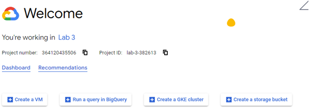

# 2)Створимо сервіс акаунт:

Перейдемо у Dashboard – Service Account. Створимо сервіс акаунт натиснувши на кнопку Create Service Account,  назвемо його, призначимо ID і видамо роль.

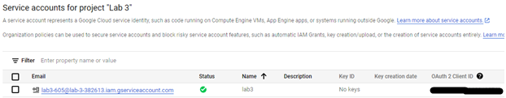

# 3)Створимо ключ доступу 

Перейдемо в Action – Manage keys та створимо ключ у форматі JSON.

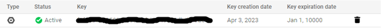

# 4)	Налаштуємо terraform

Створимо робочу директорію для terraform. Після цього створимо 3 файли: main.tf, variables.tf, outputs.tf. Спочатку налаштуємо main.tf із основною конфігурацією.

Щоб створити віртуальну машину, напишемо наступний код:
```
terraform {
  required_providers {
    google = {
      source = "hashicorp/google"
      version = "4.51.0"
    }
  }
}

provider "google" {
  credentials = file(var.credentials_file)

  project = var.project
  region  = var.region
  zone    = var.zone
}

resource "google_compute_network" "vpc_network" {
  name = "lab3network"
}

resource "google_compute_subnetwork" "lab3network" {
  name          = var.subnet_name
  network       = google_compute_network.vpc_network.self_link
  ip_cidr_range = "10.2.0.0/16"
  region        = var.region
}


resource "google_compute_instance" "vm_instance" {
  name         = var.machine_name
  machine_type = "f1-micro"
  tags = ["edu", "micro", "linux", "devops", "ukraine"]

  boot_disk {
    initialize_params {
      image = "debian-cloud/debian-11"
    }
  }

  network_interface {
    network = google_compute_network.vpc_network.name
    access_config {
    }
  }
}

resource "google_compute_firewall" "vpc-network-allow" {
  name    = "letmein"
  network = google_compute_network.vpc_network.self_link

  allow {
    protocol = "tcp"
    ports    = ["80", "8080", "1000-2000"]
  }
  target_tags = ["http-server","https-server"]
  source_tags = ["vpc-network-allow"]
}
```

Що робить код:

1. Вказує terraform, що буде працювати із gcp;

2. Додає модуль gcp під назвою google_compute_subnetwork для створення,  subnetworks. Дає цьому ресурсу назву lab3network, створили його у тому ж регіоні та vpc мережі, що і наша машина, а також задали діапазон адресів, що може займатися даною підмережею;

3. Створили віртуальну машину з необхідними тегами;

4. Конфігуруємо брандмауер для того, щоб він дозволив роботу із tcp протоколом на вказаних портах та щоб він дозволив роботу із протоколами http та https.

Файли variables.tf та outputs.tf виглядають так:
```
variable "project" {
    default = "lab-3-382613"
}

variable "credentials_file" {
    default = " lab-3-382613-f1f14a12a250.json"
}

variable "region" {
    default = "us-central1"
}

variable "zone" {
    default = "us-central1-c"
}

variable "machine_name" {
    default = "lab-3-382613-1"
}

variable "subnet_name" {
  default = "lab-3-382613-subnet-1"
}
```
outputs.tf
```
output "ip_intra" {
  value = google_compute_instance.vm_instance.network_interface.0.network_ip
}

output "ip_extra" {
  value = google_compute_instance.vm_instance.network_interface.0.access_config.0.nat_ip
}
```
Тепер перейдемо до директорії через термінал на пропишемо команду:
```
terraform init
```
Отримуємо наступне:

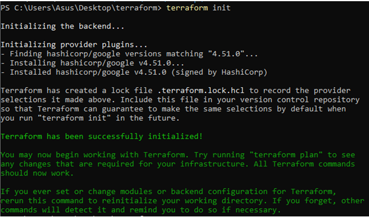

Далі пишемо:
```
terraform apply
```
Отримаємо список того, що планує зробити terraform:

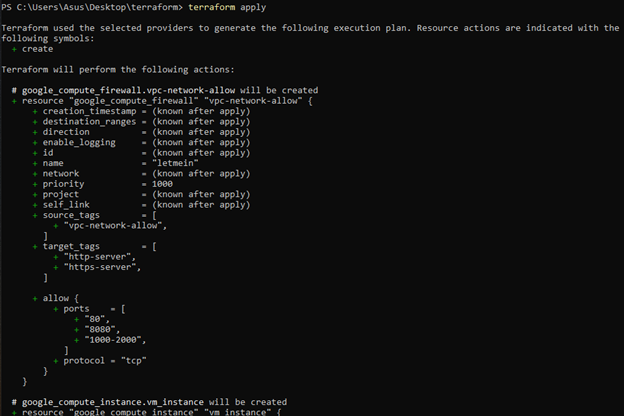

Пишемо  "yes" і чекаємо на створення віртуальної машини і її структури.

Все працює коректно, отримали:

```
Apply complete! Resources: 4 added, 0 changed, 0 destroyed.

Outputs:

ip_extra = "35.193.73.210"
ip_intra = "10.128.0.2"
```
Отримали дві ip-адреси. Одна з них – внутрішня адреса у VPC мережі Google, а інша – адреса NAT.

Подивимося чи вірно все було створино:

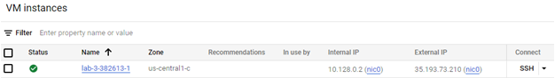
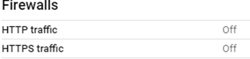
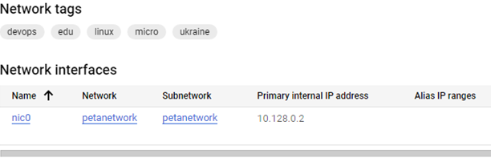
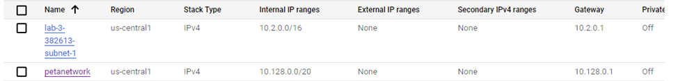

Із рисунків бачимо, що машина була створена коректно. 

Знищимо нашу ВМ командою:
```
terraform destroy
```
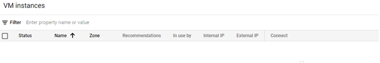

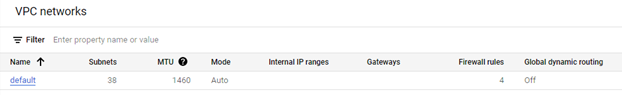

В нас не залишилося ні віртуальної машини, ні мережі, terraform виконав видалення вірно.

# Висновки

Під час виконання лабораторної роботи встановили terraform, після чого створили новий проєкт в якому створили сервіс акаунт та ключ доступу, щоб підключити terraform до cloud. Налаштували terraform, створивши робочу директорію із трьох файлів та прописавши в них, де, як та яку віртуальну машину створити, після чого запустили terraform та отримали коректну роботу із google cloud. Після того, як ми переконалися що все працює вірно, командою видалили все що створив terraform.
Як висновок можна сказати, що після першої початкової настройки terraform, користуватися їм дуже зручно, бо це економить нам дуже багато часу. Не потрібно кожен раз довго створювати віртуальну машину на сайті google cloud, а просто запустити через 1 команду і все створиться само.