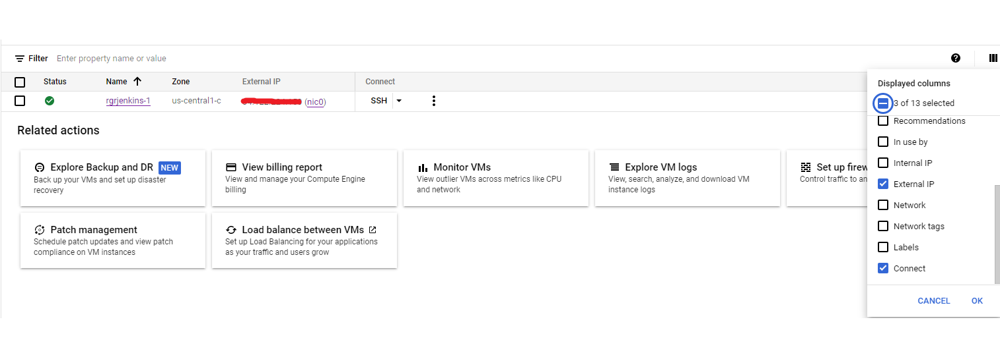
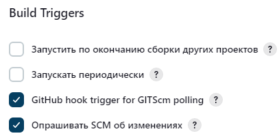
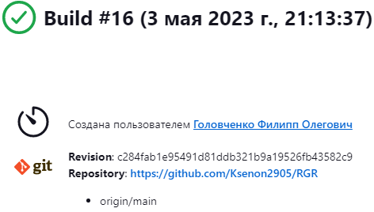
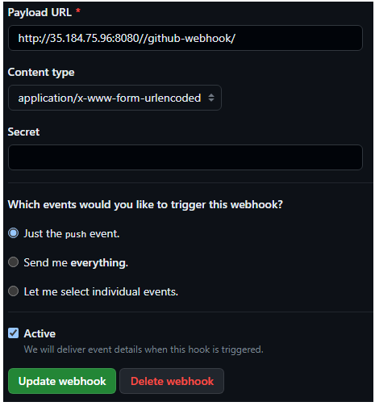

# Розрахунково-графічна робота
## Автоматизація розгортка сайту у GCP із використанням Terraform та Jenkins
## 1. Підготовка GCP для автоматизації
Створюємо проект у GCP в якому ми будемо створювати віртуальні машини за допомогою terraform.Докладно створення проекту ми розглянули в лабораторній роботі №3, тому в описі немає сенсу.
Для роботи із віртуальними машинами треба включити Compute Engine API.
Створимо service account для Terraform, создамо ключ і на цьому початкова підготовка GCP закінчена

## 2. Автоматизація створення віртуальної машини за допомогою terraform

Автоматичне створення ВМ за допомогою terraform ми розглядали в лабораторній роботі №3.
Одразу пропишиме .tf файли та коротко розглянемо їх.
```
terraform {
  required_providers {
    google = {
      source  = "hashicorp/google"
      version = "4.51.0"
    }
  }
}

provider "google" {
  credentials = file(var.credentials_file)

  project = var.project
  region  = var.region
  zone    = var.zone
}

resource "google_compute_network" "vpc_network" {
  name = "rgrvpc"
}

resource "google_compute_instance" "vm_instance" {
  name         = var.machine_name
  machine_type = "e2-medium"
  tags         = ["jenkins"]

  boot_disk {
    initialize_params {
      image = "ubuntu-os-cloud/ubuntu-minimal-2210-kinetic-amd64-v20230425"
    }
  }

  network_interface {
    network = google_compute_network.vpc_network.name
    access_config {
    }
  }
}

resource "google_compute_firewall" "rules" {
  project       = var.project
  name          = "allowall"
  network       = google_compute_network.vpc_network.self_link
  source_ranges = ["0.0.0.0/0"]

  allow {
    protocol = "tcp"
    ports    = ["20", "22", "80", "8080", "1000-2000"]
  }

  source_tags = ["vpc"]
  target_tags = ["jenkins"]
}
```

variables.tf
```
variable "project" {
  default = "rgrjenkins-1"
}

variable "credentials_file" {
  default = "rgrjenkins-1-b3a66f27604b.json"
}

variable "region" {
  default = "us-central1"
}

variable "zone" {
  default = "us-central1-c"
}

variable "machine_name" {
  default = "rgrjenkins-1"
}
```

У цих файлах ми прописуємо створення ВМ середньї конфігурації в us-central1-c зоні із операційною системою ubuntu cloud. Середню конфігурацію ми вибрали із того, що на мінімальній jenkins відкривається занадто довго. Далі нам треба вірно сконфінурувати вбудований у GCР брандмауер, щоб він давав доступ до SSH, Jenkins. Це ми робимо за допомогою налаштування ресурсу google_compute_firewall. Також, оскільки ми створили ВМ із тегами, брандмауер ми також налаштували на ці теги, щоб не впливати на інші віртуальні машини (якщо вони є).

Створимо ВМ і мережі командою:
```
terraform apply
```

Результат:
```
Apply complete! Resources: 3 added, 0 changed, 0 destroyed.

Outputs:

ip_extra = "35.239.109.110"
ip_intra = "10.128.0.2"
```

Як бачимо, створення ВМ було успішно виконано.

## 3. Налаштування середовища ВМ

Зайдемо до ВМ по SSH, встановимо деякі програми та налаштуємо її на автоматичну роботу.
Спочатку оновимо базу даних менеджеру пакетів apt.

```
sudo apt update
```

Замінемо текстовий редактор vim (як вийти?) на nano для зручності.
```
sudo apt install nano
```

Встановлюємо git щоб автоматично завантажувати із нього наш сайт.
```
sudo apt install git
```

### 3.1 Встановлення та налаштування Jenkins

Перед тим, як встановити Jenkins, встановимо Java 11 версії.
```
sudo apt install openjdk-11-jre
```
Тепер встановимо Jenkins наступною послідовністю команд (згідно до офіційного мануалу)
```
curl -fsSL https://pkg.jenkins.io/debian/jenkins.io-2023.key | sudo tee \
  /usr/share/keyrings/jenkins-keyring.asc > /dev/null
```
```
echo deb [signed-by=/usr/share/keyrings/jenkins-keyring.asc] \
  https://pkg.jenkins.io/debian binary/ | sudo tee \
  /etc/apt/sources.list.d/jenkins.list > /dev/null
```
```
sudo apt-get update
```
```
sudo apt-get install jenkins
```

Далі треба перезавантажити ВМ і Jenkins вже буде готовий до роботи.
Щоб зайти до дженкінсу треба отримати пароль. В консоль пишемо
```
sudo cat /var/lib/jenkins/secrets/initialAdminPassword
```
Копіюємо отриманий пароль та переходимо до VM instance в GCP.

 

Там ми переходимо до настройки Displayed columns та встановлюємо галочку на External IP. Теперь ми можемо скопіювати наш зовнішній IP та додати до нього :8080. Відкриється вікно першого налаштування Jenkins куди ми вставляємо скопійований раніше пароль. Встановлюємо рекомендовані плагіни та створюємо власний обліковий запис.

Щоб Jenkins міг виконувати дії від імені root пропишимо наступне в консолі ВМ:
```
cd /etc
sudo nano sudoers
```
Де після строк
```
# User privilege specification
root    ALL=(ALL:ALL) ALL
```
Додамо рядок
```
jenkins ALL=NOPASSWD: ALL
```
Це дозволить нам виконувати команди типу 'sh "sudo..."'

## 3.2 Автоматизація CI/CD

В Jenkins тиснемо "Создать Item" та обираємо Pipeline.

Тиснемо "Це проект GitHub". Пишемо посилання на наш проект, в нашому випадку це був 
```
https://github.com/Ksenon2905/RGR
```
Тепер напишемо наш скрипт для Pipeline мовою Groovy.
```
pipeline 
{
    agent any
    options
    {
        disableConcurrentBuilds()
    }
    stages 
    {
        stage('Download') 
        {
            steps 
            {
                echo "Checkout GO"
                checkout scmGit(
                    branches: [[name: 'main']],
                    userRemoteConfigs: [[url: 'https://github.com/Ksenon2905/RGR']])
                echo "Checkout OKOK"
            }
        }
        stage('Setup') 
        {
            steps {
                echo "Setup Section GO"
                sh 'sudo apt-get install apache2'
                sh 'sudo cp -f ${WORKSPACE}/index.html /var/www/html/'
                echo "Setup OKOK"
            }
        }
        stage('Run') 
        {
            steps 
            {
            echo "Run GO"
            sh 'sudo service apache2 restart'
            echo "Run OKOK"
            }
        }
    }
    post 
    {
        success
        {
            echo 'All work, gj'
        }
        failure
        {
            deleteDir()
        }
    }
}
```
Що ми прописали.

1. Спочатку ми клонуємо репозиторій із веб-сторінкою.
2. Далі ми встановлюємо apache2 (популярний відкритий сервер для хостингу сторінки).
3. Далі копіюємо отриманий файл веб-сторінки в папку /var/www/html/ з якої apache автоматично бере файли та завантажує їх на хостинг.
4. Після збірки виводиться повідомлення. Якщо збірка не вдалася - тека вичищається.

Обов'язково проставляємо галочки в настройці pipeline
1. GitHub hook trigger for GITScm polling
2. SCM Changes (Опрашивать SCM об изменениях)



Спробуємо зробити тестовий білд.


Він пройшов успішно. Але поки що реакції на оновлення Git ми не отримаємо. Щоб це зробити, до нашого репозиторію потрібно під'єднати вебхуки.
Вони будуть посилати запит до Jenkins при кожному push в репозиторій.
Це робиться в Settings (на сайті GitHub) -> Webhooks -> Add Webhook.

У якості Payload URL вказуємо адресу Jenkins і додаємо /github-webhook/

В нашому
```
http://34.122.224.150:8080/github-webhook/
```
Content type -> application/x-www-form-urlencoded

Інше за замовчуванням.



## 4. Перевірка працездатності

До цього моменту ми не перевіряли Jenkins і вважали, що все працює вірно. Але треба перевірити, чи дійсно в нас розгорнулася сторінка і чи можна зайти на неї.

Перейдемо за адресою http://34.122.224.150/ та перевіримо:


Так, веб-сторінка завантажилася на хостинг та працює.
Якщо ми змінемо її в github вона автоматично зміниться і на хостингу.

## Висновки
Для виконання РГР ми застосували усі знання, котрі отримували у межах курсу.
А саме: 
налаштування Github та використання git; 
налаштування google cloud та сервіс акаунта для підключення к терраформ;
налаштування terraform для автоматизації створення ВМ;
налаштування CI/CD, а саме робота із Jenkins.

Використовуючи ці знання в нас вийшло створити повністю робочий пайплайн з мінімумом ручної роботи.
Вручну ми робимо першу настройку ВМ для запуску Jenkins та генерацію ключів для terraform.

Після цього наш проект автоматично обновлюється кожен раз, коли ми змінюємо наш сайт на Github.